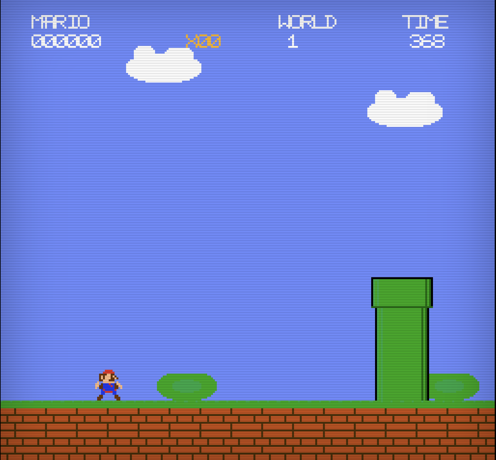

# Procedural Mario

A browser-based Mario-style platformer with procedurally generated levels. Built entirely with vanilla JavaScript and the HTML5 Canvas API — no frameworks, no build tools, no external assets. All graphics are pixel art drawn in code, and all audio is synthesized at runtime using the Web Audio API.



## Play

Open `index.html` in any modern browser. No server required.

## Controls

| Key | Action |
|---|---|
| Arrow Left / Right | Move |
| Space / Z | Jump (hold for higher jump) |
| X / Shift | Throw fireball (when Fire Mario) |
| P / Escape | Pause |
| M | Toggle mute |
| Enter / Space | Start game / restart |

## Features

- **Procedural level generation** — Every level is created from a seed using a deterministic PRNG (Mulberry32). Levels are built from randomized segments: flat ground, gaps, floating platforms, pipes, staircases, coin runs, and challenge sections.
- **Difficulty scaling** — Levels get progressively harder with wider gaps, more enemies, and tougher segment combinations.
- **Validation pass** — The generator ensures all gaps are jumpable, placing rescue platforms where needed.
- **Classic enemies** — Goombas, Koopa Troopas (with shell kicks), and Piranha Plants.
- **Power-ups** — Mushrooms (grow big), Fire Flowers (shoot fireballs), Stars (invincibility), and 1-Up Mushrooms.
- **Question and brick blocks** — Bump from below to reveal coins and power-ups. Big Mario can break bricks.
- **Physics** — Gravity, acceleration, friction, coyote time, jump buffering, and variable jump height.
- **Stomp combos** — Chain enemy stomps without landing for escalating score bonuses.
- **Flagpole finish** — Each level ends with a staircase and flagpole. Remaining time converts to bonus points.
- **Parallax backgrounds** — Scrolling clouds, hills, and bushes at different speeds.
- **CRT aesthetic** — Scanline overlay and vignette effect for a retro look.
- **Procedural audio** — All sound effects and music generated with the Web Audio API. No audio files.
- **Pixel art sprites** — All graphics drawn programmatically on canvas. No image files.
- **High score** — Persisted to `localStorage`.
- **Screen shake** — On brick breaks and block bumps.

## Project Structure

```
index.html          Entry point — loads all scripts in order
css/style.css       Layout, CRT scanlines, vignette
js/
  physics.js        Gravity, collision detection, tile-based physics
  camera.js         Viewport tracking and scrolling
  engine.js         Game loop, input, entity management, state machine
  tiles.js          Tile type definitions and properties
  tilemap.js        Tile storage and lookup
  levelgen.js       Procedural level generator (segments, validation)
  pixelart.js       Programmatic sprite drawing
  sprites.js        Sprite sheet generation and lookup
  renderer.js       Backgrounds, HUD, title/game-over screens, particles
  audio.js          Web Audio synthesized sound effects and music
  player.js         Player movement, jumping, power states, death
  enemies.js        Goomba, Koopa Troopa, Piranha Plant AI
  items.js          Coins, Mushroom, Fire Flower, Star, 1-Up, Fireball
  blocks.js         Question block and brick block interaction
  objects.js        Flagpole and level-end logic
  main.js           Game orchestration — ties all systems together
```

## How Level Generation Works

1. A seed determines all random choices via a seeded PRNG.
2. The level is built left-to-right by placing randomized **segments** (flat, gap, platforms, pipes, stairs, coin run, challenge).
3. Segment selection is weighted by difficulty — harder levels see more gaps and challenge segments, fewer flat sections.
4. A **validation pass** scans for gaps wider than the maximum jump distance and inserts rescue platforms.
5. The level always ends with an ascending staircase and flagpole.
6. Enemies, coins, and block contents are placed contextually within each segment.

## Requirements

A modern browser with HTML5 Canvas and Web Audio API support (Chrome, Firefox, Safari, Edge).
